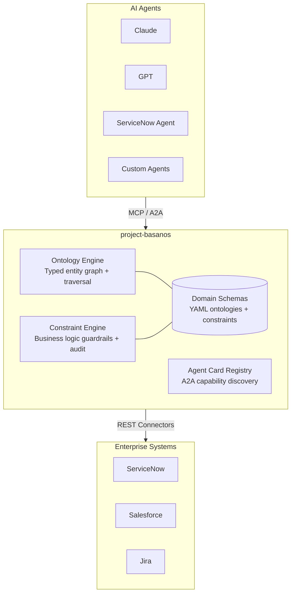
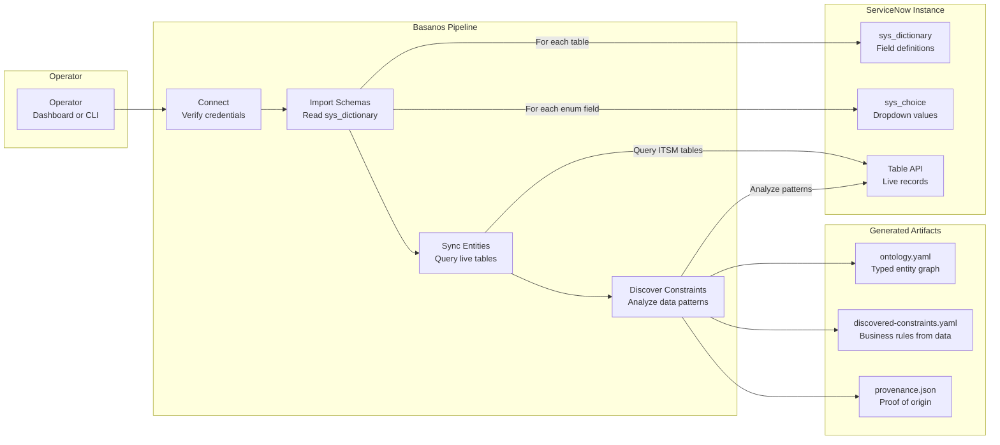
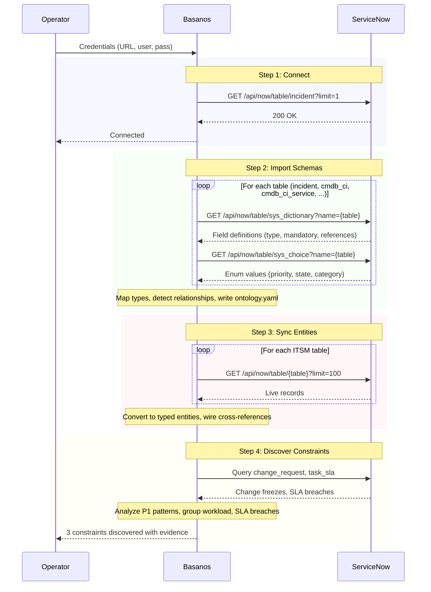
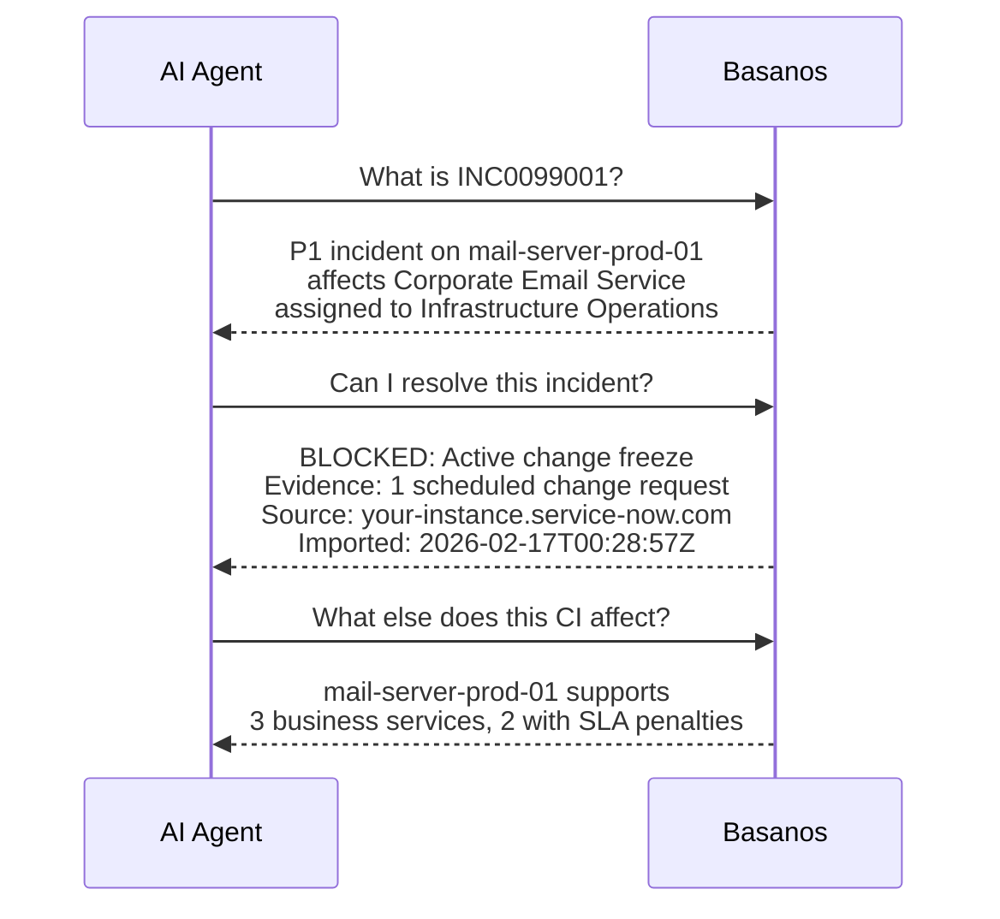
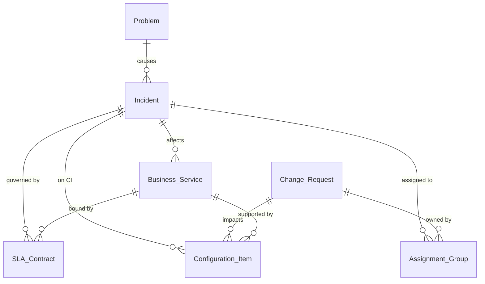

# project-basanos

> *A living tarot for the agentic age. Gives AI agents a real understanding of what they're operating on, not just API access.*

**Basanos** (βάσανος) is Greek for a touchstone used to test the purity of gold. In Mike Carey's *Lucifer*, the Basanos is a living tarot deck that reads relationships, predicts consequences, and understands deep architecture. It served no master.

This project brings that idea to AI agents.

## Why not just use Claude Desktop?

If you're a human asking Claude about your ServiceNow instance, Claude is smart enough to figure out most things on the fly. Basanos is redundant for that.

Basanos matters when there is no human in the loop:

- **3am agents can't ask you questions.** An agent resolving incidents overnight needs to *know* there's a change freeze, not guess.
- **Not every model is Claude.** Smaller, cheaper models need domain knowledge handed to them. Basanos gives them what they can't infer.
- **Multiple agents need one truth.** Two agents reasoning about the same incident independently will disagree. Basanos gives them a shared map.
- **System prompts are suggestions. Verdicts are guarantees.** A `BLOCK` with entity IDs and an audit trail beats "please don't do this" in a prompt.
- **Conversations reset. Knowledge persists.** Every chat starts from zero. Basanos compounds over time.
- **You can test a knowledge model. You can't test a conversation.**

For the full analysis, see [docs/DIFFERENTIATORS.md](docs/DIFFERENTIATORS.md).

## The Problem

Most AI agents today can *do* things but don't understand *what* they're working with. They call APIs, get data back, and hope the LLM figures out the rest. That works until it doesn't.

An MCP server that queries ServiceNow incidents? That's just a REST wrapper. An MCP server that knows how those incidents connect to CMDB items, change requests, business services, SLA contracts, and the teams who own them? That's what's missing.

## What Basanos Does

Basanos sits between your agents and enterprise systems, giving agents three things they don't have today:

### 1. A map of how things connect
Not "here's a table" but "here's how incidents, services, CIs, and SLAs relate to each other." An agent using Basanos doesn't just get incident records. It understands that this P1 affects a business service with an SLA penalty, owned by a VP who escalates within 30 minutes.

### 2. Business rules that actually enforce
When Basanos exposes a "resolve incident" action, it also checks: *is there a change freeze? Is this group overloaded? Has the SLA already breached?* These aren't security rules. They're **business logic** that requires domain knowledge to define.

### 3. Agent-to-agent discovery
Other agents can discover what Basanos knows via A2A, seeing its capabilities like an API contract: what it can do, what it needs, and what it guarantees.

## Architecture



## How It Works: ServiceNow Integration Pipeline

Basanos connects to a live ServiceNow instance to import schemas, sync entities, and discover constraints automatically.



### What each step does



### What agents see after import



Every answer traces back to a real API call, a real record, a real timestamp. The provenance is baked in.

## Quick Start

```bash
git clone https://github.com/leojacinto/project-basanos.git
cd project-basanos
npm install && npm run build

# Run the MCP server (hand-crafted ITSM ontology)
npm start

# Explore visually (multi-domain, light/dark mode, auto port scan)
npm run dashboard

# Inspect with MCP Inspector
npm run inspect
```

### Connect to a live ServiceNow instance

```bash
cp .env.example .env          # Configure credentials
npm run cli -- full            # Full pipeline: connect > import > sync > discover

# Or step by step
npm run cli -- connect         # Test connection
npm run cli -- import          # Import table schemas to YAML
npm run cli -- sync            # Sync live entities
npm run cli -- discover        # Discover constraints from data patterns
```

Or use the **Connect tab** in the dashboard to run the pipeline from the browser.

### Test with the mock server

```bash
npm run mock-snow              # Starts mock at http://localhost:8090
npm run cli -- full            # In another terminal
```

## Project Structure

```
src/
├── index.ts                 # MCP server entry point (6 tools, dynamic resources)
├── cli.ts                   # CLI: connect, import, sync, discover
├── dashboard.ts             # Web UI with multi-domain support + light/dark mode
├── loader.ts                # YAML schema/constraint loader
├── ontology/
│   ├── engine.ts            # Ontology resolution and traversal
│   ├── types.ts             # Core ontology type system
│   └── schema.ts            # Schema loading and validation
├── constraints/
│   ├── engine.ts            # Constraint evaluation engine with audit trail
│   ├── types.ts             # Constraint type definitions
│   └── rule-evaluator.ts    # Declarative rule engine (YAML conditions)
├── connectors/
│   ├── servicenow.ts        # ServiceNow REST API connector
│   ├── schema-importer.ts   # sys_dictionary → ontology.yaml
│   ├── entity-sync.ts       # Live table data → Basanos entities
│   └── constraint-discovery.ts  # Data pattern analysis → suggested constraints
├── a2a/
│   └── types.ts             # A2A agent card types and generation
├── mock/
│   └── servicenow-server.ts # Mock ServiceNow REST API for testing
├── server/
│   ├── resources.ts         # MCP resource handlers
│   └── tools.ts             # MCP tool handler reference
└── test/
    ├── smoke.ts             # 32-assertion engine test suite
    ├── yaml-loader.ts       # 23-assertion YAML loader tests
    └── scenario-autonomous.ts  # 3am incident demo (with vs without Basanos)
domains/
├── itsm/                    # Hand-crafted ITSM ontology (YAML, promoted)
│   ├── ontology.yaml
│   └── constraints.yaml
├── servicenow-demo/         # Auto-imported from mock server (committed)
│   ├── ontology.yaml
│   ├── discovered-constraints.yaml  # status: candidate
│   └── provenance.json
└── servicenow-live/         # Auto-imported from real instance (gitignored)
    ├── ontology.yaml
    ├── discovered-constraints.yaml  # status: candidate
    └── provenance.json
docs/
└── DIFFERENTIATORS.md       # Critical analysis: why Basanos vs Claude Desktop
```

## Proof Domain: ITSM



ITSM is the first domain because the relationships are rich, the business rules are clear, and the impact is measurable. An agent with Basanos makes better decisions: fewer wrong escalations, awareness of change freezes, and accurate impact assessment.

## Protocols

| Protocol | Role | Status |
|----------|------|--------|
| **MCP** (Model Context Protocol) | Vertical: agent ↔ tools/data | ✅ Primary |
| **A2A** (Agent2Agent) | Horizontal: agent ↔ agent | 🔜 Planned |
| **ACP** (Agent Communication Protocol) | Lightweight REST messaging | 🔜 Planned |

## Security & Authentication

### Basanos is not MCP-on-MCP

ServiceNow ships its own MCP server for live data access (reads, writes, OAuth-scoped). Basanos does not wrap or replace it. The two serve different purposes and run side by side:

| | ServiceNow MCP | Basanos MCP |
|---|---|---|
| **Purpose** | Live CRUD on tables | Domain knowledge, relationships, constraint verdicts |
| **Connection** | Real-time, every request | Import-time only, then fully offline |
| **Auth** | OAuth per request | OAuth or basic at import, none at query time |

An agent uses **both**: ServiceNow MCP to read/write records, Basanos MCP to understand what those records mean and whether an action is safe.

### Auth modes

The connector auto-detects which mode to use based on your `.env`:

| Variables set | Auth mode | When to use |
|---|---|---|
| `CLIENT_ID` + `CLIENT_SECRET` | OAuth client_credentials | Production, service accounts |
| `CLIENT_ID` + `CLIENT_SECRET` + `USERNAME` + `PASSWORD` | OAuth password grant | When you need user context with OAuth |
| `USERNAME` + `PASSWORD` only | Basic auth | Dev, mock server, quick testing |

**OAuth setup in ServiceNow:** System OAuth > Application Registry > Create an OAuth API endpoint. Scope the app to read-only on the tables you need (sys_dictionary, incident, cmdb_ci, etc.).

### What to know about security

- **Read-only.** Basanos never writes back to ServiceNow. There is no mutation path.
- **Import-time only.** Credentials are used during the import step. After that, Basanos serves from local YAML with zero connection to ServiceNow.
- **Data at rest.** The generated `ontology.yaml` and `provenance.json` contain table structures, field names, and record counts. Not credentials, but structural metadata. Treat these files accordingly in sensitive environments.
- **Credentials in `.env`.** The `.env` file is gitignored. For production, use OAuth with scoped, read-only service accounts.

## Landscape & Prior Art

The problem is well-identified. Anthropic calls it "context engineering" ([Building Effective Agents](https://www.anthropic.com/research/building-effective-agents)). Everyone agrees agents need structured domain knowledge. The gap is that nobody has shipped an open tool for it.

### Adjacent projects

| Project | What it does | Where Basanos differs |
|---------|-------------|---------------------|
| [**Timbr.ai**](https://timbr.ai) | SQL knowledge graph for BI and analytics. | Built for dashboards, not agents. No MCP, no constraints. |
| [**Palantir Ontology**](https://www.palantir.com/platforms/aip/) | Enterprise ontology inside Palantir's platform. | Proprietary. Requires full Palantir buy-in. |
| [**AtScale**](https://www.atscale.com) | Metric governance layer for BI tools. | Governs "what does revenue mean," not entity relationships or business rules. |
| [**dbt MetricFlow**](https://docs.getdbt.com/docs/build/about-metricflow) | Metric definitions in dbt. | Same category as AtScale: metrics, not domain models. |
| [**ZBrain**](https://zbrain.ai) | Agentic platform with knowledge graphs + vector stores. | Closer in concept, but proprietary platform play. |
| [**Hiflylabs**](https://hiflylabs.com/blog) | Reference architecture for semantic + agent layers. | A blog post describing what should exist. Not a shipped tool. |

### The gap

No one has built an **open-source, MCP-native domain model** that agents can discover, traverse, and use for constraint-checked decisions. The ideas exist in blogs, in proprietary platforms, and in academic papers. Basanos assembles them into something you can actually run.

The "dbt for agent knowledge" doesn't exist yet. That's Basanos.

## Design Principles

### Core philosophy

- **No allegiance.** Works with any platform, any model, any vendor.
- **Infrastructure over hype.** A durable layer, not another wrapper.
- **Depth over breadth.** One domain done right beats ten done shallow.
- **Business logic, not security.** Guardrails for correctness, not threat detection.

### Constraint lifecycle

Discovered constraints are not automatically enforced. They follow a deliberate promotion workflow:

```
candidate  --->  promoted  --->  disabled
   ^                |               |
   |                v               |
   +----------  demoted  <----------+
```

- **Candidate**: discovered from data or hand-crafted but not yet reviewed. Visible in the dashboard but not enforced by agents.
- **Promoted**: reviewed by a human and actively enforced. Agents calling `basanos_check_constraints` will receive block/warn verdicts from these.
- **Disabled**: explicitly paused. Was promoted, now turned off (e.g., during a maintenance window).

### Don't build a rule engine

Most systems of record already have their own rule engines (ServiceNow Business Rules, Salesforce Flows, Jira Automation). Basanos discovers patterns and surfaces them as guardrails for agents. It does not replace downstream rule engines.

The right workflow is: Basanos discovers a pattern, a human promotes it as an agent guardrail, and if deeper enforcement is needed, the rule gets implemented in the system of record itself. Basanos is the touchstone, not the courthouse.

### The 80/20 controls

The dashboard exposes three controls per constraint:
1. **Status** (candidate / promoted / disabled)
2. **Severity** (block / warn / info)
3. That's it.

Editing conditions, operators, entity scopes, and other deep rule logic belongs in YAML files, reviewed by architects in version control. The dashboard is for operational decisions, not rule authoring.

## Contributing

project-basanos is open source and welcomes contributors. The "project-" prefix is intentional: this is a living effort, not a finished artifact.

See [CONTRIBUTING.md](CONTRIBUTING.md) for guidelines.

## License

[MIT](LICENSE)

---

*"Protocols move data. Structure makes it usable. Without structure, interoperability is just organized confusion."*
