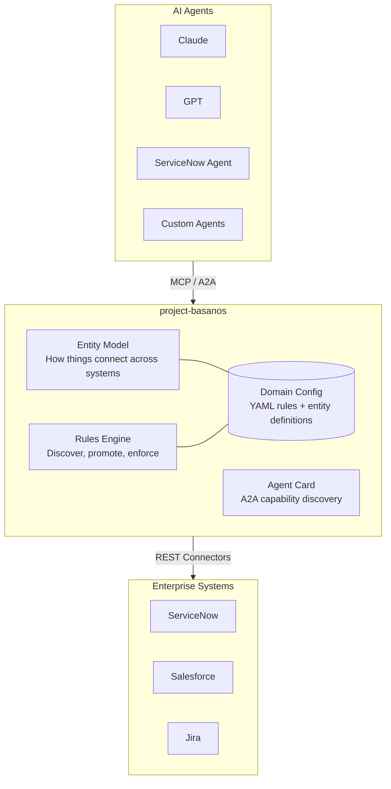
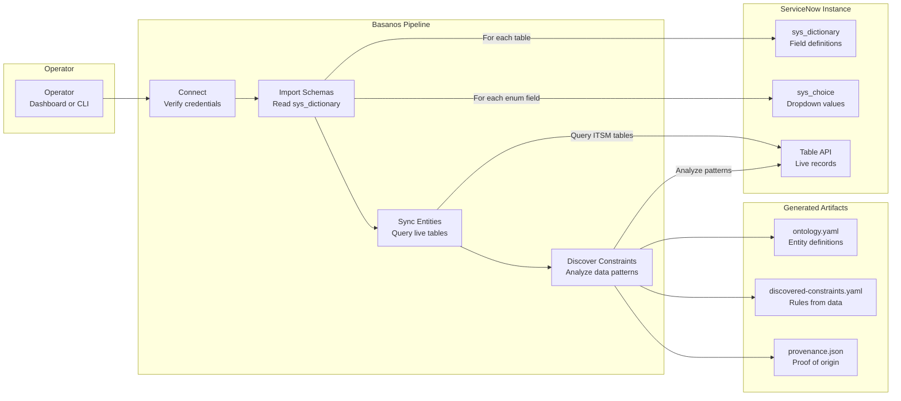
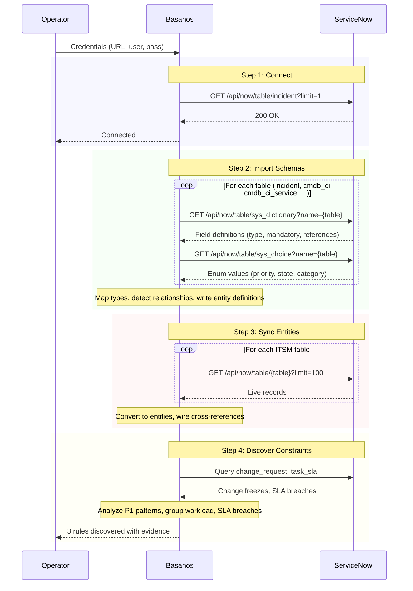
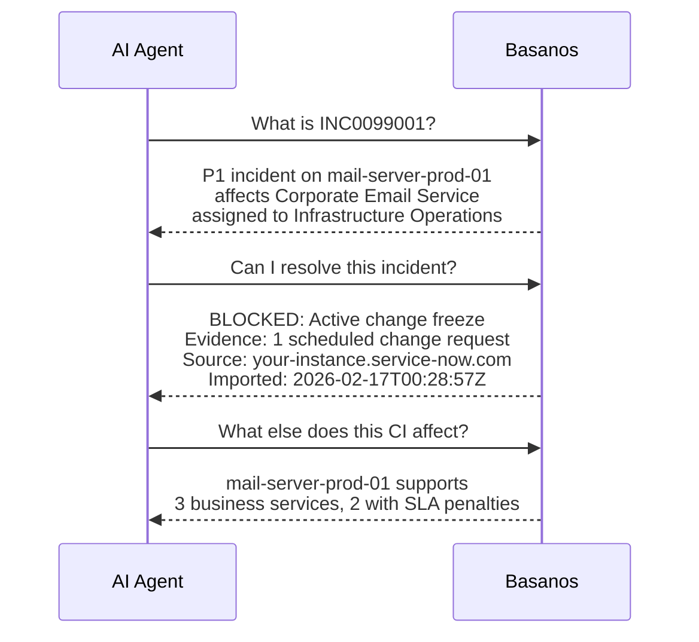
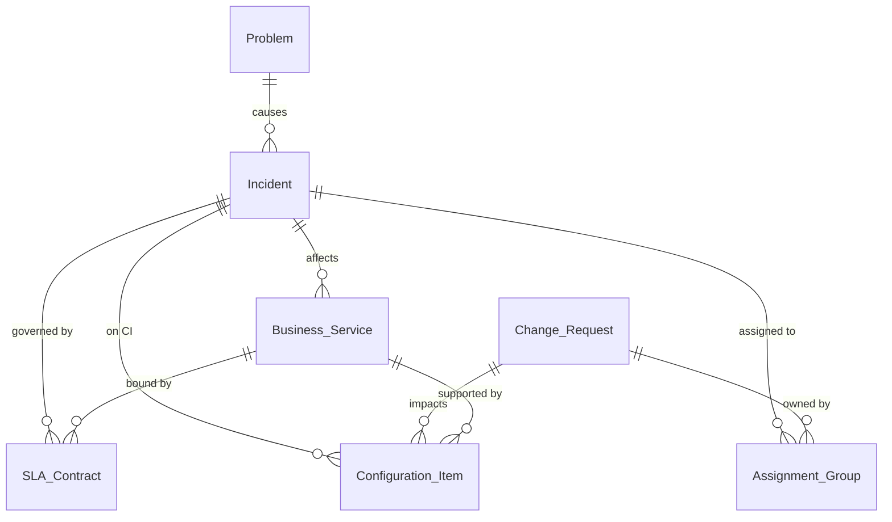

# project-basanos

> **Multi-system Agentic Rules Engine** - Discovers, promotes, and enforces rules for AI agents across multiple enterprise systems.

**Basanos** (βάσανος) is Greek for a touchstone used to test the purity of gold. In Mike Carey's *Lucifer*, the Basanos is a living tarot deck that reads relationships, predicts consequences, and understands deep architecture. It served no master.

This project brings that idea to AI agents.

## The Problem

AI agents can call APIs across ServiceNow, Jira, Salesforce, and more. But no single system knows what the others are doing. ServiceNow business rules cannot see Jira deploys. Jira automation cannot see ServiceNow change freezes. When agents operate across these systems, there is no shared enforcement layer.

System prompts say "please don't resolve incidents during a change freeze." Basanos says `BLOCKED` with evidence, entity IDs, and an audit trail.

## What Basanos Does

Basanos sits between your agents and enterprise systems. It does three things:

### 1. Discovers rules from your data
Connects to live systems (ServiceNow, Jira, etc.), analyzes patterns (P1 reopen rates, change freezes, SLA breaches), and surfaces rule candidates. These are guardrails you have not built yet, discovered from your actual data.

### 2. Enforces rules across systems
An agent calls "resolve incident" through Basanos. Basanos checks ServiceNow for change freezes **and** Jira for active deploys on the same service. No single system sees both risks. Basanos evaluates rules across system boundaries before allowing or blocking the action.

### 3. Keeps humans in the loop
Discovered rules start as candidates. A human reviews and promotes them before they enforce. No rule fires without human review. Demote or disable at any time.

## Architecture



## How It Works

Basanos connects to live systems, imports their structure, and discovers rules automatically. Here is the ServiceNow pipeline:



### What each step does



### What agents see after import



Every answer traces back to a real API call, a real record, a real timestamp. The provenance is baked in.

## Demo

The dashboard has two demo tabs:

### Single-system Demo

Walks through the full Basanos narrative against a live ServiceNow instance:

1. **Discover** - Basanos analyzes data patterns and surfaces constraint candidates. While this can be done via Business Rules in ServiceNow or equivalent mechanisms in other systems, the same concept applies across multiple systems and agent platforms.
2. **Promote** - A human reviews candidates and promotes the ones that matter. No rules fire without human review.
3. **Enforce** - Any MCP client calls a tool through Basanos. Basanos enriches context, evaluates constraints, and blocks or allows the call.

### Multi-system Demo

The scenario no single system can handle alone. Basanos enriches context from **both** ServiceNow and Jira, then evaluates constraints that span both systems:

- **INC0025428** - ServiceNow has a change freeze, Jira has no deploy. **BLOCKED.** Jira-only tooling would have let this through.
- **INC0025729** - ServiceNow has no change freeze, but Jira has an active deploy. **BLOCKED.** ServiceNow business rules would have let this through.
- **INC0018834** - Both systems clear. Allowed.

Both directions are demonstrated: ServiceNow catches what Jira missed, and Jira catches what ServiceNow missed. No single system sees both risks.

## Quick Start with Docker (Recommended)

The easiest way to run Basanos. No need to install Node.js or TypeScript.

### Step 1: Install Docker Desktop

Docker Desktop is the only prerequisite.

- **macOS**: Download [Docker Desktop for Mac](https://desktop.docker.com/mac/main/amd64/Docker.dmg), drag to Applications, launch
- **Windows**: Download [Docker Desktop for Windows](https://desktop.docker.com/win/main/amd64/Docker%20Desktop%20Installer.exe), run installer, restart
- **Linux**: `curl -fsSL https://get.docker.com -o get-docker.sh && sudo sh get-docker.sh`

Verify: `docker --version`

### Step 2: Run with Docker Compose

```bash
git clone https://github.com/leojacinto/project-basanos.git
cd project-basanos
docker compose up
```

Open [http://localhost:3001](http://localhost:3001) - the dashboard loads with a mock ServiceNow instance, sample ITSM data, and 11 discovery rules.

**Docker Hub image**: [`leofrancia08489/project-basanos:v0.1.0`](https://hub.docker.com/r/leofrancia08489/project-basanos)

### Step 3: Connect to a real ServiceNow instance (optional)

Create a `.env` file in the project root:

```bash
# Schema import (basic auth or OAuth)
SERVICENOW_INSTANCE_URL=https://your-instance.service-now.com
SERVICENOW_USERNAME=admin
SERVICENOW_PASSWORD=your-password

# MCP Proxy Gateway (OAuth client_credentials)
SERVICENOW_MCP_SERVER_URL=https://your-instance.service-now.com/sncapps/mcp-server/mcp/sn_mcp_server_default
SERVICENOW_CLIENT_ID=your-client-id
SERVICENOW_CLIENT_SECRET='your-client-secret'
```

Then restart: `docker compose up`

The dashboard will use your real credentials. Go to the **Connect** tab to import schemas and discover constraints, then use the **Demo** tab to test constraint enforcement against live data.

## Quick Start (Developer)

```bash
git clone https://github.com/leojacinto/project-basanos.git
cd project-basanos
npm install && npm run build

# Run the MCP server (hand-crafted ITSM ontology)
npm start

# Explore visually (multi-domain, light/dark mode, auto port scan)
npm run dashboard

# Inspect with MCP Inspector
npm run inspect
```

### Connect to a live ServiceNow instance

```bash
cp .env.example .env          # Configure credentials
npm run cli -- full            # Full pipeline: connect > import > sync > discover

# Or step by step
npm run cli -- connect         # Test connection
npm run cli -- import          # Import table schemas to YAML
npm run cli -- sync            # Sync live entities
npm run cli -- discover        # Discover constraints from data patterns
```

Or use the **Connect tab** in the dashboard to run the pipeline from the browser.

### Test with the mock server

```bash
npm run mock-snow              # Starts mock at http://localhost:8090
npm run cli -- full            # In another terminal
```

## Project Structure

```
src/
├── index.ts                 # MCP server entry point (6 tools, dynamic resources)
├── cli.ts                   # CLI: connect, import, sync, discover
├── dashboard.ts             # Web UI: rules engine dashboard, demos, light/dark mode
├── loader.ts                # YAML schema/constraint loader
├── ontology/
│   ├── engine.ts            # Entity model resolution and traversal
│   ├── types.ts             # Core type system
│   └── schema.ts            # Schema loading and validation
├── constraints/
│   ├── engine.ts            # Rules evaluation engine with audit trail
│   ├── types.ts             # Rule type definitions
│   └── rule-evaluator.ts    # Declarative rule evaluator (YAML conditions)
├── connectors/
│   ├── servicenow.ts        # ServiceNow REST API connector
│   ├── servicenow-mcp.ts    # ServiceNow MCP proxy (OAuth, tool exec, context enrichment)
│   ├── schema-importer.ts   # sys_dictionary -> entity definitions
│   ├── entity-sync.ts       # Live table data -> Basanos entities
│   └── constraint-discovery.ts  # Data pattern analysis -> suggested rules
├── a2a/
│   └── types.ts             # A2A agent card types and generation
├── mock/
│   └── servicenow-server.ts # Mock ServiceNow REST API for testing
├── server/
│   ├── resources.ts         # MCP resource handlers
│   └── tools.ts             # MCP tool handler reference
└── test/
    ├── smoke.ts             # 32-assertion engine test suite
    ├── yaml-loader.ts       # 23-assertion YAML loader tests
    └── scenario-autonomous.ts  # 3am incident demo (with vs without Basanos)
domains/
├── itsm/                    # Hand-crafted ITSM domain (YAML, promoted)
│   ├── ontology.yaml
│   └── constraints.yaml
├── servicenow-demo/         # Auto-imported from mock server (committed)
│   ├── ontology.yaml
│   ├── discovered-constraints.yaml  # status: candidate
│   └── provenance.json
└── servicenow-live/         # Auto-imported from real instance (gitignored)
    ├── ontology.yaml
    ├── discovered-constraints.yaml  # status: candidate
    └── provenance.json
docs/
└── DIFFERENTIATORS.md       # Critical analysis: why Basanos vs Claude Desktop
```

## Starting Domain: ITSM



ITSM is the first domain because the relationships are rich, the rules are clear, and the impact is measurable. An agent with Basanos makes better decisions: fewer wrong escalations, awareness of change freezes, and accurate impact assessment.

## Protocols

| Protocol | Role | Status |
|----------|------|--------|
| **MCP** (Model Context Protocol) | Vertical: agent ↔ tools/data | ✅ Primary |
| **A2A** (Agent2Agent) | Horizontal: agent ↔ agent | 🔜 Planned |
| **ACP** (Agent Communication Protocol) | Lightweight REST messaging | 🔜 Planned |

## MCP Proxy Gateway

Basanos can act as a **rules-enforcing proxy** in front of ServiceNow's native MCP Server. Any MCP client (Claude, Copilot, Google ADK, a human) connects to Basanos instead of directly to ServiceNow. Basanos intercepts tool calls, enriches context from the target system, evaluates rules, and blocks or forwards the call.

```
Any MCP Client (Claude, Copilot, Google ADK, human)
  -> Basanos MCP Server (constraint gateway)
    -> ServiceNow MCP Server (execution)
```

Configure in `.env`:

```bash
SERVICENOW_MCP_SERVER_URL=https://your-instance.service-now.com/sncapps/mcp-server/mcp/sn_mcp_server_default
SERVICENOW_CLIENT_ID=your-client-id
SERVICENOW_CLIENT_SECRET='your-client-secret'
```

The proxy enriches each tool call with live context (incident priority, CI, active change requests, SLA breaches) before evaluating rules. This means the same "Resolve incident" tool can be blocked for one incident (active change freeze on its CI) and allowed for another (no changes) - based on real system state, not static configuration.

### Why not just use ServiceNow business rules?

ServiceNow's server-side rules (business rules, data policies, ACLs) protect ServiceNow data regardless of how requests arrive. They are mature and cover their own surface well.

Basanos adds value at a different layer:

- **Cross-system rules** - "Don't resolve this incident if there's an open deploy in Jira for the same service." ServiceNow rules cannot see Jira.
- **Discovery** - Basanos finds rule patterns from your data that you have not built as business rules yet.
- **Protocol gateway** - One enforcement point for all MCP traffic, regardless of which agent or system is calling.
- **Vendor-neutral** - Same rules engine whether the target is ServiceNow, Salesforce, or a custom API.

For a single-system, single-vendor scenario, business rules are simpler. Basanos is for the layer above - where multiple systems, multiple agents, and multiple protocols intersect.

## Security & Authentication

### Auth modes

The connector auto-detects which mode to use based on your `.env`:

| Variables set | Auth mode | When to use |
|---|---|---|
| `CLIENT_ID` + `CLIENT_SECRET` | OAuth client_credentials | Production, service accounts |
| `CLIENT_ID` + `CLIENT_SECRET` + `USERNAME` + `PASSWORD` | OAuth password grant | When you need user context with OAuth |
| `USERNAME` + `PASSWORD` only | Basic auth | Dev, mock server, quick testing |

**OAuth setup in ServiceNow:** System OAuth > Application Registry > Create an OAuth API endpoint. Scope the app to read-only on the tables you need (sys_dictionary, incident, cmdb_ci, etc.).

### What to know about security

- **Proxy mode.** When acting as an MCP proxy, Basanos can forward write operations to ServiceNow's MCP Server after constraint checks pass. The proxy uses OAuth client_credentials for authentication.
- **Read-only import.** The schema import pipeline never writes back to ServiceNow.
- **Import-time only.** Credentials are used during the import step. After that, Basanos serves from local YAML with zero connection to ServiceNow.
- **Data at rest.** The generated `ontology.yaml` and `provenance.json` contain table structures, field names, and record counts. Not credentials, but structural metadata. Treat these files accordingly in sensitive environments.
- **Credentials in `.env`.** The `.env` file is gitignored. For production, use OAuth with scoped, read-only service accounts.

## Landscape & Prior Art

The problem is well-identified. Anthropic calls it "context engineering" ([Building Effective Agents](https://www.anthropic.com/research/building-effective-agents)). Everyone agrees agents need structured domain knowledge. The gap is that nobody has shipped an open tool for it.

### Adjacent projects

| Project | What it does | Where Basanos differs |
|---------|-------------|---------------------|
| [**Timbr.ai**](https://timbr.ai) | SQL knowledge graph for BI and analytics. | Built for dashboards, not agents. No MCP, no constraints. |
| [**Palantir Ontology**](https://www.palantir.com/platforms/aip/) | Enterprise ontology inside Palantir's platform. | Proprietary. Requires full Palantir buy-in. |
| [**AtScale**](https://www.atscale.com) | Metric governance layer for BI tools. | Governs "what does revenue mean," not entity relationships or business rules. |
| [**dbt MetricFlow**](https://docs.getdbt.com/docs/build/about-metricflow) | Metric definitions in dbt. | Same category as AtScale: metrics, not domain models. |
| [**ZBrain**](https://zbrain.ai) | Agentic platform with knowledge graphs + vector stores. | Closer in concept, but proprietary platform play. |
| [**Hiflylabs**](https://hiflylabs.com/blog) | Reference architecture for semantic + agent layers. | A blog post describing what should exist. Not a shipped tool. |

### The gap

No one has built an **open-source, MCP-native rules engine** that discovers patterns from live systems and enforces them across multiple platforms. The ideas exist in blogs, in proprietary platforms, and in academic papers. Basanos assembles them into something you can actually run.

## Design Principles

### Core philosophy

- **No allegiance.** Works with any platform, any model, any vendor.
- **Infrastructure over hype.** A durable layer, not another wrapper.
- **Depth over breadth.** One domain done right beats ten done shallow.
- **Business logic, not security.** Guardrails for correctness, not threat detection.

### Rule lifecycle

Discovered rules are not automatically enforced. They follow a deliberate promotion workflow:

```
candidate  --->  promoted  --->  disabled
   ^                |               |
   |                v               |
   +----------  demoted  <----------+
```

- **Candidate**: discovered from data or hand-crafted but not yet reviewed. Visible in the dashboard but not enforced by agents.
- **Promoted**: reviewed by a human and actively enforced. Agents calling `basanos_check_constraints` will receive block/warn verdicts from these.
- **Disabled**: explicitly paused. Was promoted, now turned off (e.g., during a maintenance window).

### Complement, don't replace

Most systems of record already have their own rule engines (ServiceNow Business Rules, Salesforce Flows, Jira Automation). Basanos discovers patterns and surfaces them as guardrails for agents. It does not replace those engines.

The right workflow is: Basanos discovers a pattern, a human promotes it as an agent guardrail, and if deeper enforcement is needed, the rule gets implemented in the system of record itself. Basanos is the touchstone, not the courthouse.

### The 80/20 controls

The dashboard exposes two controls per rule:
1. **Status** (candidate / promoted / disabled)
2. **Severity** (block / warn / info)
3. That's it.

Editing conditions, operators, entity scopes, and other deep rule logic belongs in YAML files, reviewed by architects in version control. The dashboard is for operational decisions, not rule authoring.

## Contributing

project-basanos is open source and welcomes contributors. The "project-" prefix is intentional: this is a living effort, not a finished artifact.

See [CONTRIBUTING.md](CONTRIBUTING.md) for guidelines.

## License

[MIT](LICENSE)


