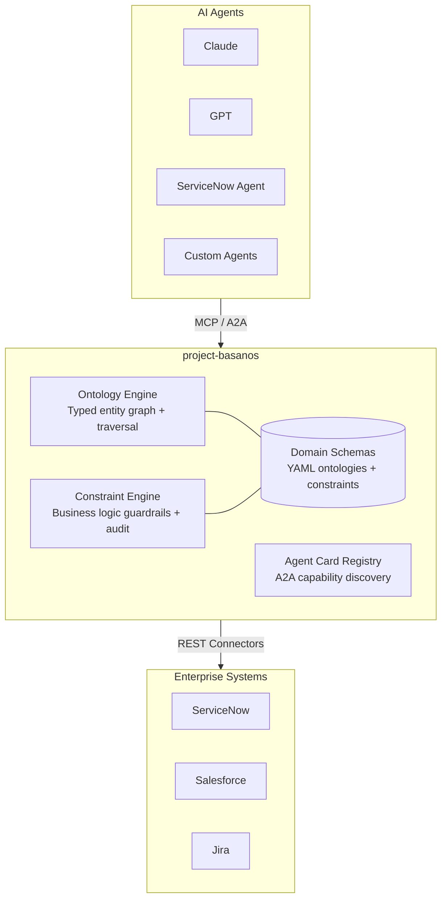
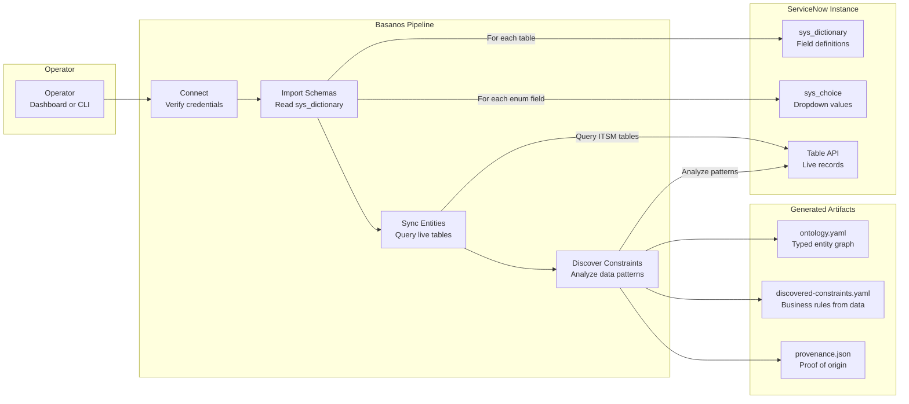
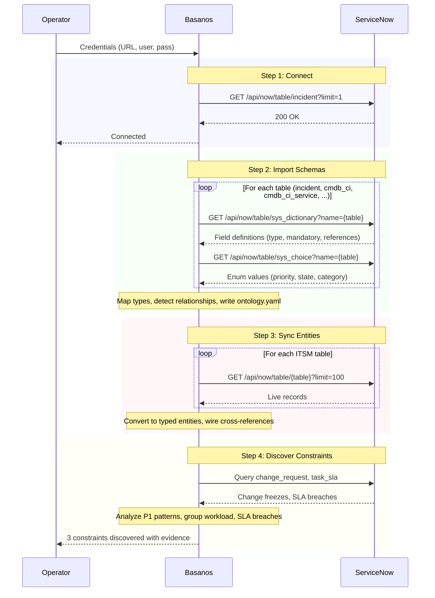
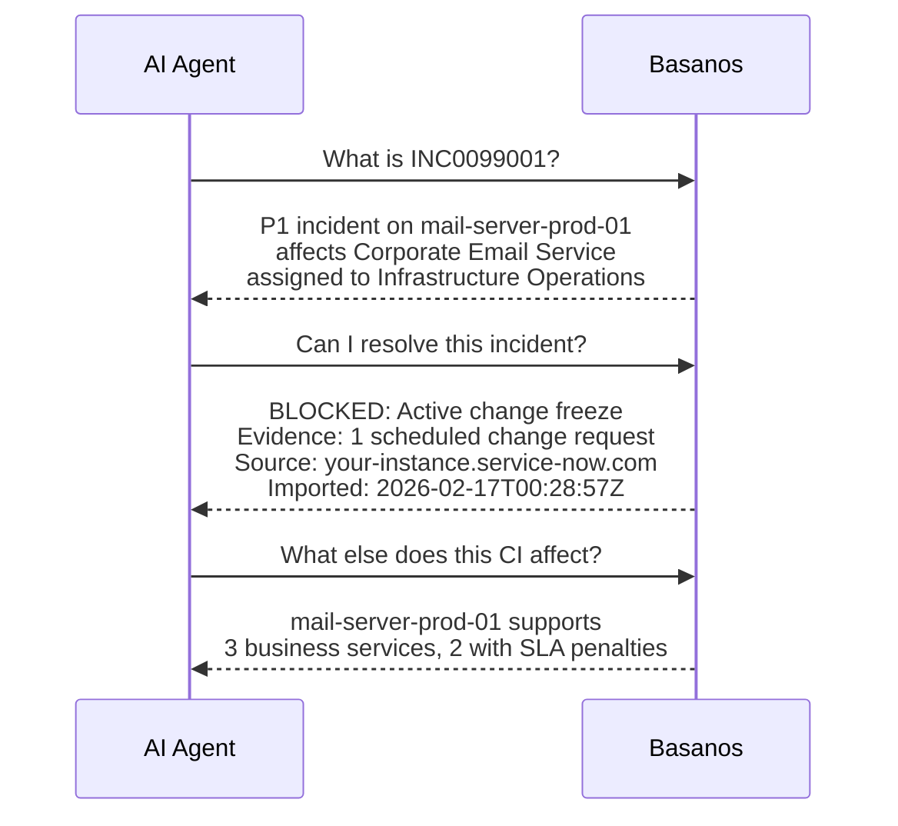
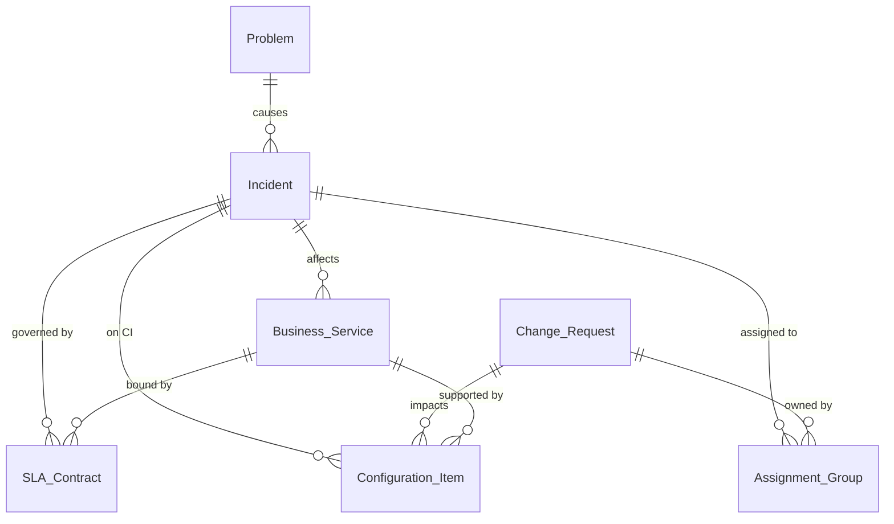

# project-basanos

> *A living tarot for the agentic age. Semantic ontology and context intelligence over MCP, so your agents finally understand what they're operating on.*

**Basanos** (βάσανος) is the ancient Greek word for a touchstone used to test the purity of gold. In Mike Carey's *Lucifer*, the Basanos is a living tarot deck that gained sentience: it doesn't just contain information, it interprets the structure of reality itself. It reads relationships, predicts consequences, understands deep architecture. It served no master.

This project brings that concept to the agentic age.

## Why not just use Claude Desktop?

If you're a knowledgeable human sitting at a desk asking Claude about your ServiceNow instance, Claude's reasoning is strong enough to figure out most relationships on the fly. For that use case, Basanos is arguably redundant.

Basanos earns its existence the moment there is no human in the loop:

- **Autonomous agents need encoded judgment.** An agent resolving incidents at 3am can't ask you if there's a change freeze. The ontology is the human judgment, encoded.
- **Not every model is Claude.** Smaller, cheaper models need domain understanding handed to them. Basanos levels up weaker models with structured context they can't infer.
- **Multiple agents need shared truth.** Two agents reasoning independently about the same incident will reach different conclusions. Basanos gives them a single source of semantic truth.
- **Constraints are architectural, not conversational.** A system prompt is a suggestion. A `BLOCK` verdict with entity IDs and audit trail is a guarantee.
- **Ontology compounds, conversations don't.** Every Claude session starts from zero. Basanos persists and grows.
- **Testable and auditable.** You can unit test an ontology and audit every constraint verdict. You cannot unit test a conversation.

For the full critical analysis, see [docs/DIFFERENTIATORS.md](docs/DIFFERENTIATORS.md).

## The Problem

Today's AI agents are dumb execution pipes. They can *do* things but have zero semantic understanding of *what* they're operating on or *why*. The "intelligence" is fully outsourced to the LLM's general reasoning, which means every action is contextually naive.

An MCP server that lets you query ServiceNow incidents is table stakes. An MCP server that provides a **typed ontology** of how those incidents relate to CMDB CIs, change requests, business services, SLA contracts, and the humans who own them? That doesn't exist.

## What Basanos Does

Basanos is a **protocol-native semantic context server** that sits between agents and the systems they operate on, providing:

### Domain Ontology as MCP Resources
Not "here's a table you can query" but "here's the relationship graph of this domain, typed and traversable." An agent consuming Basanos doesn't just get incident records. It gets the understanding that this P1 incident affects a business service with an SLA penalty clause, owned by a VP who escalates within 30 minutes.

### Constraint-Aware Guardrails as MCP Tool Metadata
When Basanos exposes a "resolve incident" tool, it also exposes the business constraints: *don't auto-resolve if there's an active change freeze*, *don't reassign if the assigned group has workload limits*. These aren't security guardrails. They're **business logic guardrails** that require domain knowledge to define.

### A2A-Ready Agent Cards
When another agent discovers Basanos via A2A, it sees typed capabilities with preconditions and postconditions, like a proper API contract but for agent reasoning.

## Architecture



## How It Works: ServiceNow Integration Pipeline

Basanos connects to a live ServiceNow instance to import schemas, sync entities, and discover constraints automatically.



### What each step does



### What agents see after import



Every answer traces back to a real API call, a real record, a real timestamp. The provenance is baked in.

## Quick Start

```bash
git clone https://github.com/leojacinto/project-basanos.git
cd project-basanos
npm install && npm run build

# Run the MCP server (hand-crafted ITSM ontology)
npm start

# Explore visually (multi-domain, light/dark mode, auto port scan)
npm run dashboard

# Inspect with MCP Inspector
npm run inspect
```

### Connect to a live ServiceNow instance

```bash
cp .env.example .env          # Configure credentials
npm run cli -- full            # Full pipeline: connect > import > sync > discover

# Or step by step
npm run cli -- connect         # Test connection
npm run cli -- import          # Import table schemas to YAML
npm run cli -- sync            # Sync live entities
npm run cli -- discover        # Discover constraints from data patterns
```

Or use the **Connect tab** in the dashboard to run the pipeline from the browser.

### Test with the mock server

```bash
npm run mock-snow              # Starts mock at http://localhost:8090
npm run cli -- full            # In another terminal
```

## Project Structure

```
src/
├── index.ts                 # MCP server entry point (6 tools, dynamic resources)
├── cli.ts                   # CLI: connect, import, sync, discover
├── dashboard.ts             # Web UI with multi-domain support + light/dark mode
├── loader.ts                # YAML schema/constraint loader
├── ontology/
│   ├── engine.ts            # Ontology resolution and traversal
│   ├── types.ts             # Core ontology type system
│   └── schema.ts            # Schema loading and validation
├── constraints/
│   ├── engine.ts            # Constraint evaluation engine with audit trail
│   ├── types.ts             # Constraint type definitions
│   └── rule-evaluator.ts    # Declarative rule engine (YAML conditions)
├── connectors/
│   ├── servicenow.ts        # ServiceNow REST API connector
│   ├── schema-importer.ts   # sys_dictionary → ontology.yaml
│   ├── entity-sync.ts       # Live table data → Basanos entities
│   └── constraint-discovery.ts  # Data pattern analysis → suggested constraints
├── a2a/
│   └── types.ts             # A2A agent card types and generation
├── mock/
│   └── servicenow-server.ts # Mock ServiceNow REST API for testing
├── server/
│   ├── resources.ts         # MCP resource handlers
│   └── tools.ts             # MCP tool handler reference
└── test/
    ├── smoke.ts             # 32-assertion engine test suite
    ├── yaml-loader.ts       # 23-assertion YAML loader tests
    └── scenario-autonomous.ts  # 3am incident demo (with vs without Basanos)
domains/
├── itsm/                    # Hand-crafted ITSM ontology (YAML)
│   ├── ontology.yaml
│   └── constraints.yaml
└── servicenow-live/         # Auto-imported from ServiceNow (generated)
    ├── ontology.yaml
    ├── discovered-constraints.yaml
    └── provenance.json
docs/
└── DIFFERENTIATORS.md       # Critical analysis: why Basanos vs Claude Desktop
```

## Proof Domain: ITSM



ITSM was chosen as the first domain because it has rich entity relationships, well-defined business constraints, and clear measurability. An agent with Basanos makes measurably better decisions: fewer incorrect escalations, proper change freeze awareness, accurate impact assessment.

## Protocols

| Protocol | Role | Status |
|----------|------|--------|
| **MCP** (Model Context Protocol) | Vertical: agent ↔ tools/data | ✅ Primary |
| **A2A** (Agent2Agent) | Horizontal: agent ↔ agent | 🔜 Planned |
| **ACP** (Agent Communication Protocol) | Lightweight REST messaging | 🔜 Planned |

## Landscape & Prior Art

The problem Basanos addresses is well-identified in the industry. The implementation gap is what makes this project worth building.

### Who's talking about it

Anthropic's engineering team has outlined the discipline of providing the right information and tools in the right format for an LLM to accomplish a task, a practice increasingly called "context engineering" ([Building Effective Agents](https://www.anthropic.com/research/building-effective-agents)). The thought-leadership circuit broadly argues that metric definition and ontology engineering are fundamentally different disciplines, and that semantic layers alone aren't enough for autonomous agent reasoning.

### Who's building adjacent things

| Project | What it does | How Basanos differs |
|---------|-------------|---------------------|
| [**Timbr.ai**](https://timbr.ai) | SQL-native ontology-based semantic layer that turns scattered tables into a queryable knowledge graph with business-friendly concepts and hierarchies. | Focused on data analytics and BI, not agent-native. Not MCP-delivered, not designed for autonomous agent reasoning or constraint enforcement. |
| [**Palantir Ontology**](https://www.palantir.com/platforms/aip/) | Enterprise ontology within Palantir's data ecosystem. The 800-pound gorilla of "enterprise ontology." | Proprietary walled garden. Not an open protocol-native tool. Requires full Palantir platform buy-in. |
| [**AtScale**](https://www.atscale.com) | Universal semantic layer for BI metrics governance. Defines "what does revenue mean" consistently across tools. | Governs metric definitions, not entity relationships, business constraints, or operational guardrails for autonomous action. |
| [**dbt MetricFlow**](https://docs.getdbt.com/docs/build/about-metricflow) | Semantic graph for defining and querying metrics in dbt. Ensures consistent metric computation across consumers. | Same category as AtScale: metric semantics, not domain ontology or agent constraint awareness. |
| [**ZBrain**](https://zbrain.ai) | Enterprise agentic AI platform with a hybrid approach combining knowledge graphs as semantic filters with vector stores. | Closer conceptually, but it's a proprietary platform play, not an open composable building block. |
| [**Hiflylabs**](https://hiflylabs.com/blog) | Published a reference architecture describing a semantic layer (OWL/RDF in a knowledge graph), interaction layer (APIs/tools), agent layer, and orchestration layer. | Closest conceptual match, but it's a blog post describing what should exist, not a shipped artifact. |

### What nobody has done

The specific intersection Basanos targets: a **protocol-native** (MCP/A2A), **domain-modelled**, **constraint-aware** ontology server designed specifically for **autonomous agent reasoning**, shipped as an **open-source** project.

The pieces exist in thought leadership, in proprietary platforms, and in academic knowledge graph work. Nobody has assembled them into an open, composable building block that an agent can discover and consume via standard protocols.

The "dbt for agent ontology" doesn't exist yet. That's Basanos.

## Philosophy

- **No allegiance.** Platform-agnostic, model-agnostic, vendor-agnostic.
- **Infrastructure over hype.** Durable semantic layer, not another wrapper.
- **Domain depth over breadth.** One domain done right beats ten done shallow.
- **Business logic, not security.** Guardrails for correctness, not threat detection.

## Contributing

project-basanos is open source and welcomes contributors. The "project-" prefix is intentional: this is a living effort, not a finished artifact.

See [CONTRIBUTING.md](CONTRIBUTING.md) for guidelines.

## License

[MIT](LICENSE)

---

*"Protocols move data. Semantics make data usable. Without semantics, interoperability becomes structured confusion."*
