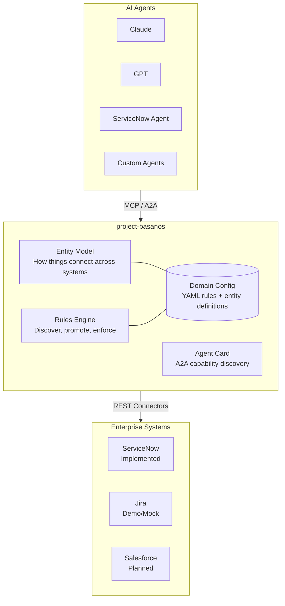
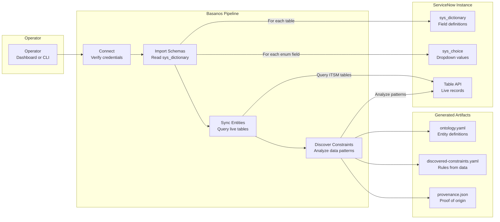
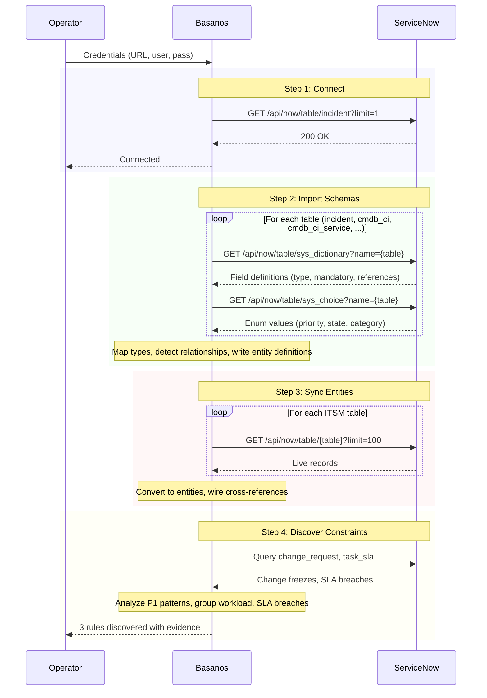
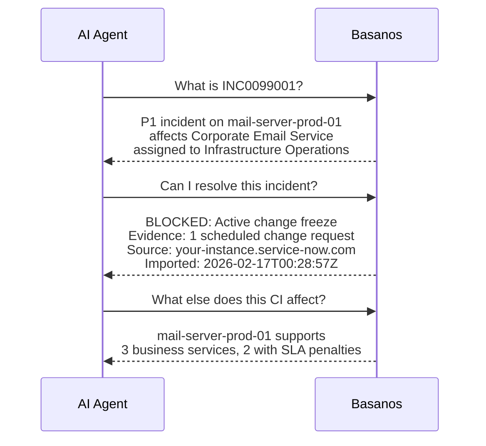
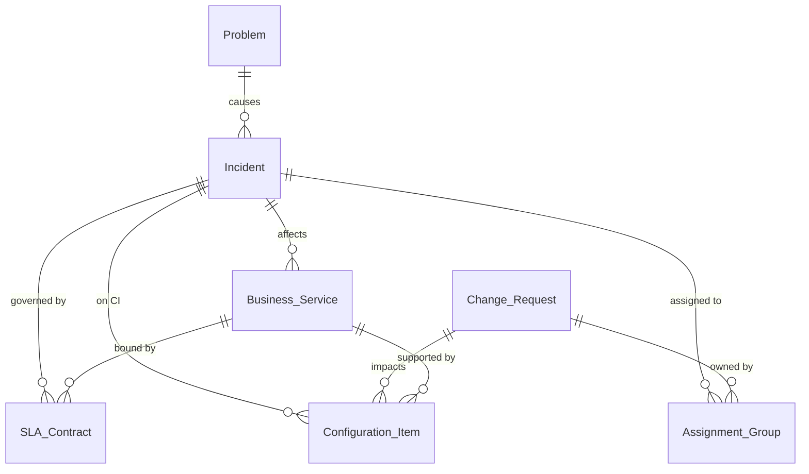

# project-basanos

> A reference implementation exploring how AI agents can discover, promote, and enforce rules across enterprise systems - built against ServiceNow.

**Basanos** (βάσανος) is Greek for a touchstone used to test the purity of gold. In Mike Carey's *Lucifer*, the Basanos is a living tarot deck that reads relationships, predicts consequences, and understands deep architecture. It served no master.

## What this is

Basanos is an applied study, not a product. It explores a specific question: when AI agents operate across multiple enterprise systems, how should cross-system rules be discovered, reviewed, and enforced?

The study is built against ServiceNow's ITSM ecosystem because that is what I know. The ServiceNow connector is real and works against live instances. A mock Jira integration demonstrates how enforcement could extend across system boundaries. The concepts apply to any multi-system environment, but the implementation is rooted in ServiceNow.

This is a solo open-source project. MCP gateways and agent governance are becoming an active category with funded teams (Cerbos, TrojAI, SAFE-MCP, Red Hat). Basanos is not competing with them. It is a working prototype that explores the pattern and documents what was learned.

## The question

ServiceNow has business rules. Jira has automation. Salesforce has flows. Each system enforces rules within its own boundary. But no single system sees what the others are doing. A ServiceNow business rule cannot check whether Jira has an active deploy on the same service. Jira automation cannot check whether ServiceNow has a change freeze.

When AI agents operate across these systems, who enforces rules that span the boundary?

Basanos explores one answer: an MCP proxy gateway that sits between agents and target systems, intercepts tool calls, enriches context from multiple sources, and returns `BLOCK` or `ALLOW` verdicts before the action executes. A blocked action never reaches the target system. This is runtime enforcement, not context injection - Basanos does not dump rules into a system prompt and hope the LLM follows them.

## What the code does

**ServiceNow connector** - connects to a live instance via REST API. Imports table schemas from `sys_dictionary`, syncs live entities, and acts as an MCP proxy gateway that intercepts tool calls, enriches context, and enforces rules before forwarding to ServiceNow's native MCP Server.

**Rules engine** - YAML-driven. Rules are loaded into memory at startup and evaluated per-request against live system state. Only promoted rules matching the intended action are checked. Returns `BLOCK` or `ALLOW` with evidence and audit trail.

**Rule discovery** - heuristic pattern analysis (not ML or AI inference). Coded algorithms scan your data for known anti-patterns: change freezes, SLA breaches, P1 reopen rates, CI failure patterns. The output is rule candidates, not enforced rules.

**Human-in-the-loop lifecycle** - discovered rules start as candidates. A human reviews and promotes them before they enforce. No rule fires without human approval. Demote or disable at any time.

**Cross-system demo** - mock Jira data demonstrates how enforcement would work across system boundaries. ServiceNow data is live; Jira data is mock. The demo shows both directions: ServiceNow catching what Jira missed, and Jira catching what ServiceNow missed.

### Current scope

- **ServiceNow** is the implemented connector (REST API, schema import, entity sync, MCP proxy). Jira is mock data for the cross-system demo. Additional connectors follow the same pattern.
- **Rule discovery** uses heuristic pattern matching - coded algorithms that scan for known anti-patterns (change freezes, SLA breaches, P1 reopens).
- **MCP server** runs and can be called by any MCP client. Agent-specific integrations (Claude Desktop config, etc.) are left to the operator.
- **Cross-system semantic alignment** (mapping equivalent concepts across platforms) is an open problem not yet addressed.

## Architecture



## How It Works

Basanos connects to a live system, imports its structure, and discovers rules. Today this pipeline is implemented for ServiceNow:



### What each step does



### What agents see after import



Every answer traces back to a real API call, a real record, a real timestamp. The provenance is baked in.

## Demo

The dashboard has two demo tabs:

### Single-system Demo

Walks through the full Basanos narrative against a live ServiceNow instance:

1. **Discover** - Basanos analyzes data patterns and surfaces constraint candidates. While this can be done via Business Rules in ServiceNow or equivalent mechanisms in other systems, the same concept applies across multiple systems and agent platforms.
2. **Promote** - A human reviews candidates and promotes the ones that matter. No rules fire without human review.
3. **Enforce** - Any MCP client calls a tool through Basanos. Basanos enriches context, evaluates constraints, and blocks or allows the call.

### Multi-system Demo

Demonstrates the cross-system enforcement concept using live ServiceNow data and **mock Jira data** (no Jira credentials needed). Basanos enriches context from both sources, then evaluates rules that span both systems:

- **INC0025428** - ServiceNow has a change freeze, Jira has no deploy. **BLOCKED.** Jira-only tooling would have let this through.
- **INC0025729** - ServiceNow has no change freeze, but Jira has an active deploy. **BLOCKED.** ServiceNow business rules would have let this through.
- **INC0018834** - Both systems clear. Allowed.

Both directions are demonstrated: ServiceNow catches what Jira missed, and Jira catches what ServiceNow missed. No single system sees both risks.

## Quick Start with Docker (Recommended)

The easiest way to run Basanos. No need to install Node.js or TypeScript.

### Step 1: Install Docker Desktop

Docker Desktop is the only prerequisite.

- **macOS**: Download [Docker Desktop for Mac](https://desktop.docker.com/mac/main/amd64/Docker.dmg), drag to Applications, launch
- **Windows**: Download [Docker Desktop for Windows](https://desktop.docker.com/win/main/amd64/Docker%20Desktop%20Installer.exe), run installer, restart
- **Linux**: `curl -fsSL https://get.docker.com -o get-docker.sh && sudo sh get-docker.sh`

Verify: `docker --version`

### Step 2: Run with Docker Compose

```bash
git clone https://github.com/leojacinto/project-basanos.git
cd project-basanos
docker compose up
```

Open [http://localhost:3001](http://localhost:3001) - the dashboard loads with a mock ServiceNow instance, sample ITSM data, and 11 discovery rules.

**Docker Hub image**: [`leofrancia08489/project-basanos:v0.1.0`](https://hub.docker.com/r/leofrancia08489/project-basanos)

### Step 3: Connect to a real ServiceNow instance (optional)

Create a `.env` file in the project root:

```bash
# Schema import (basic auth or OAuth)
SERVICENOW_INSTANCE_URL=https://your-instance.service-now.com
SERVICENOW_USERNAME=admin
SERVICENOW_PASSWORD=your-password

# MCP Proxy Gateway (OAuth client_credentials)
SERVICENOW_MCP_SERVER_URL=https://your-instance.service-now.com/sncapps/mcp-server/mcp/sn_mcp_server_default
SERVICENOW_CLIENT_ID=your-client-id
SERVICENOW_CLIENT_SECRET='your-client-secret'
```

Then restart: `docker compose up`

The dashboard will use your real credentials. Go to the **Connect** tab to import schemas and discover constraints, then use the **Demo** tab to test constraint enforcement against live data.

## Quick Start (Developer)

```bash
git clone https://github.com/leojacinto/project-basanos.git
cd project-basanos
npm install && npm run build

# Run the MCP server (hand-crafted ITSM ontology)
npm start

# Explore visually (multi-domain, light/dark mode, auto port scan)
npm run dashboard

# Inspect with MCP Inspector
npm run inspect
```

### Connect to a live ServiceNow instance

```bash
cp .env.example .env          # Configure credentials
npm run cli -- full            # Full pipeline: connect > import > sync > discover

# Or step by step
npm run cli -- connect         # Test connection
npm run cli -- import          # Import table schemas to YAML
npm run cli -- sync            # Sync live entities
npm run cli -- discover        # Discover constraints from data patterns
```

Or use the **Connect tab** in the dashboard to run the pipeline from the browser.

### Test with the mock server

```bash
npm run mock-snow              # Starts mock at http://localhost:8090
npm run cli -- full            # In another terminal
```

## Project Structure

```
src/
├── index.ts                 # MCP server entry point (6 tools, dynamic resources)
├── cli.ts                   # CLI: connect, import, sync, discover
├── dashboard.ts             # Web UI: rules engine dashboard, demos, light/dark mode
├── loader.ts                # YAML schema/constraint loader
├── ontology/
│   ├── engine.ts            # Entity model resolution and traversal
│   ├── types.ts             # Core type system
│   └── schema.ts            # Schema loading and validation
├── constraints/
│   ├── engine.ts            # Rules evaluation engine with audit trail
│   ├── types.ts             # Rule type definitions
│   └── rule-evaluator.ts    # Declarative rule evaluator (YAML conditions)
├── connectors/
│   ├── servicenow.ts        # ServiceNow REST API connector
│   ├── servicenow-mcp.ts    # ServiceNow MCP proxy (OAuth, tool exec, context enrichment)
│   ├── schema-importer.ts   # sys_dictionary -> entity definitions
│   ├── entity-sync.ts       # Live table data -> Basanos entities
│   └── constraint-discovery.ts  # Data pattern analysis -> suggested rules
├── a2a/
│   └── types.ts             # A2A agent card types and generation
├── mock/
│   └── servicenow-server.ts # Mock ServiceNow REST API for testing
├── server/
│   ├── resources.ts         # MCP resource handlers
│   └── tools.ts             # MCP tool handler reference
└── test/
    ├── smoke.ts             # 32-assertion engine test suite
    ├── yaml-loader.ts       # 23-assertion YAML loader tests
    └── scenario-autonomous.ts  # 3am incident demo (with vs without Basanos)
domains/
├── itsm/                    # Hand-crafted ITSM domain (YAML, promoted)
│   ├── ontology.yaml
│   └── constraints.yaml
├── servicenow-demo/         # Auto-imported from mock server (committed)
│   ├── ontology.yaml
│   ├── discovered-constraints.yaml  # status: candidate
│   └── provenance.json
└── servicenow-live/         # Auto-imported from real instance (gitignored)
    ├── ontology.yaml
    ├── discovered-constraints.yaml  # status: candidate
    └── provenance.json
docs/
└── DIFFERENTIATORS.md       # Critical analysis: why Basanos vs Claude Desktop
```

## Starting Domain: ITSM



ITSM is the first domain because the relationships are rich, the rules are clear, and the impact is measurable. An agent with Basanos makes better decisions: fewer wrong escalations, awareness of change freezes, and accurate impact assessment.

## Protocols

| Protocol | Role | Status |
|----------|------|--------|
| **MCP** (Model Context Protocol) | Vertical: agent ↔ tools/data | ✅ Primary |
| **A2A** (Agent2Agent) | Horizontal: agent ↔ agent | 🔜 Planned |
| **ACP** (Agent Communication Protocol) | Lightweight REST messaging | 🔜 Planned |

## MCP Proxy Gateway

Basanos can act as a **rules-enforcing proxy** in front of ServiceNow's native MCP Server. Any MCP client (Claude, Copilot, Google ADK, a human) connects to Basanos instead of directly to ServiceNow. Basanos intercepts tool calls, enriches context from the target system via live API queries (not cached or static data), evaluates rules, and blocks or forwards the call. Rules are loaded into memory at startup from YAML and evaluated per-request. Only promoted rules matching the intended action are checked - not every rule in the system.

```
Any MCP Client (Claude, Copilot, Google ADK, human)
  -> Basanos MCP Server (constraint gateway)
    -> ServiceNow MCP Server (execution)
```

Configure in `.env`:

```bash
SERVICENOW_MCP_SERVER_URL=https://your-instance.service-now.com/sncapps/mcp-server/mcp/sn_mcp_server_default
SERVICENOW_CLIENT_ID=your-client-id
SERVICENOW_CLIENT_SECRET='your-client-secret'
```

The proxy enriches each tool call with live context (incident priority, CI, active change requests, SLA breaches) before evaluating rules. This means the same "Resolve incident" tool can be blocked for one incident (active change freeze on its CI) and allowed for another (no changes) - based on real system state, not static configuration.

### Why not just use ServiceNow business rules?

ServiceNow's server-side rules (business rules, data policies, ACLs) protect ServiceNow data regardless of how requests arrive. They are mature and cover their own surface well. For a single-system scenario, they are the right answer.

Basanos explores the layer above - what happens when the rule needs to see across system boundaries:

- **Cross-system awareness** - "Don't resolve this incident if there's an open deploy in Jira for the same service." ServiceNow rules cannot see Jira.
- **Discovery** - heuristic analysis that surfaces known anti-patterns from your data as rule candidates for human review.
- **Protocol gateway** - a single enforcement point for MCP tool calls, regardless of which agent or system is calling.

This is not a replacement for business rules. It is a study of what a complementary layer might look like.

## Security & Authentication

### Auth modes

The connector auto-detects which mode to use based on your `.env`:

| Variables set | Auth mode | When to use |
|---|---|---|
| `CLIENT_ID` + `CLIENT_SECRET` | OAuth client_credentials | **Recommended.** Service accounts, proxy gateway. |
| `CLIENT_ID` + `CLIENT_SECRET` + `USERNAME` + `PASSWORD` | OAuth password grant | When you need user context with OAuth |
| `USERNAME` + `PASSWORD` only | Basic auth | Dev and mock server only |

### Recommended setup

**Use OAuth client_credentials for anything beyond local testing.** Basic auth is supported for convenience with the mock server but should not be used against real instances.

1. **Create a dedicated OAuth client** in ServiceNow: System OAuth > Application Registry > Create an OAuth API endpoint.
2. **Scope permissions to read-only** on the tables Basanos needs (`sys_dictionary`, `sys_choice`, `incident`, `cmdb_ci`, `cmdb_ci_service`, `change_request`, `task_sla`, `sys_user_group`).
3. **Use a service account**, not a personal admin account. Basanos does not need admin privileges for schema import or entity sync.
4. **For the MCP proxy gateway**, the OAuth client needs access to the MCP Server scope. The proxy forwards tool calls after rule evaluation - scope the client to only the tools you intend to expose.

### How credentials are used

- **Schema import** reads from ServiceNow's Table API. It never writes back.
- **MCP proxy** forwards tool calls (including writes like "resolve incident") only after rules pass. The proxy authenticates via OAuth client_credentials.
- **After import**, Basanos serves from local YAML files with no connection to ServiceNow. Credentials are only used during import and live proxy calls.

### Data at rest

- The generated `ontology.yaml` and `provenance.json` contain table structures, field names, and record counts. No credentials, but structural metadata. Treat these files accordingly in sensitive environments.
- The `.env` file is gitignored. Do not commit credentials to version control.

## Related Work

The problem of agent governance is well-identified. Anthropic calls it "context engineering" ([Building Effective Agents](https://www.anthropic.com/research/building-effective-agents)). The space is moving fast.

### MCP governance and policy enforcement

| Project | What it does |
|---------|-------------|
| [**Cerbos**](https://cerbos.dev) | Policy enforcement layer for MCP. Linux Foundation backing. |
| [**SAFE-MCP**](https://openid.net) | MCP security standard. Linux Foundation + OpenID Foundation. |
| [**TrojAI Defend**](https://trojai.com) | Runtime enforcement for MCP tool calls. Commercial. |
| **Red Hat OpenShift AI** | MCP governance integrated into platform. |

These are funded teams building production-grade solutions. Basanos explores similar territory as a study, not as a competitor.

### Enterprise knowledge and ontology

| Project | What it does |
|---------|-------------|
| [**Palantir Ontology**](https://www.palantir.com/platforms/aip/) | Enterprise ontology inside Palantir's platform. Proprietary. |
| [**Timbr.ai**](https://timbr.ai) | SQL knowledge graph for BI and analytics. |
| [**ZBrain**](https://zbrain.ai) | Agentic platform with knowledge graphs + vector stores. |

### What Basanos explores differently

Basanos combines MCP proxy, YAML rules engine, heuristic rule discovery, and cross-system enforcement in a single open-source codebase. The individual pieces exist elsewhere (often in better-resourced projects). The value of this study is in wiring them together against a real ServiceNow instance and documenting how they interact.

## Concepts Explored

### Design choices

- **Depth over breadth.** One domain (ITSM/ServiceNow) done well, rather than shallow coverage of many.
- **Runtime enforcement, not context injection.** Verdicts are returned before the action executes. Rules are not injected into prompts.
- **Business logic, not security.** Guardrails for correctness (change freezes, SLA awareness), not threat detection.
- **Complement, not compete.** Existing system rules (business rules, automation, flows) are the right answer within their boundary. This explores what sits above.

### Rule lifecycle

Discovered rules are not automatically enforced. They follow a deliberate promotion workflow:

```
candidate  --->  promoted  --->  disabled
   ^                |               |
   |                v               |
   +----------  demoted  <----------+
```

- **Candidate**: discovered from data or hand-crafted but not yet reviewed. Visible in the dashboard but not enforced by agents.
- **Promoted**: reviewed by a human and actively enforced. Agents calling `basanos_check_constraints` will receive block/warn verdicts from these.
- **Disabled**: explicitly paused. Was promoted, now turned off (e.g., during a maintenance window).

### The 80/20 controls

The dashboard exposes two controls per rule:
1. **Status** (candidate / promoted / disabled)
2. **Severity** (block / warn / info)

Deep rule logic (conditions, operators, entity scopes) lives in YAML files under version control. The dashboard is for operational decisions, not rule authoring.

## Contributing

project-basanos is open source. The "project-" prefix is intentional - this is an exploration, not a finished product.

If the concepts here are interesting to you, contributions are welcome. See [CONTRIBUTING.md](CONTRIBUTING.md) for guidelines.

## License

[MIT](LICENSE)


